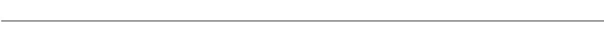

---
output:
  html_document:
      theme: paper
---
 

##**News**

 

**Feb 2019:** We have just completed our camera trap survey at Samuel Ecological Station (SEE). Besides being the first systematic survey on medium and large-sized mammals within SEE, this study aimed to understand the impacts of the hydroelectric dam reservoir on the mammal community in the continuous forest adjacent to the reservoir. Lucas Gonçalves and Felipe Pessoa joined the field trip to conduct bat survey. This study was funded by The Alongside Wildlife Foundation, University of California-Davis and SEDAM-Rondônia.

Photo (L-R): Felipe, Daniel, Finicius, Fabio and Lucas at SEE research base. (by Lucas Gonçalves)

 

{width=1000px}

